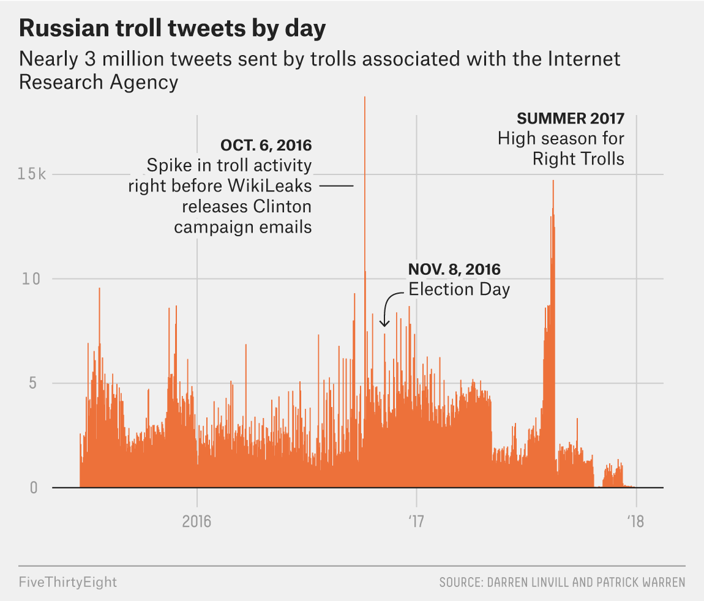
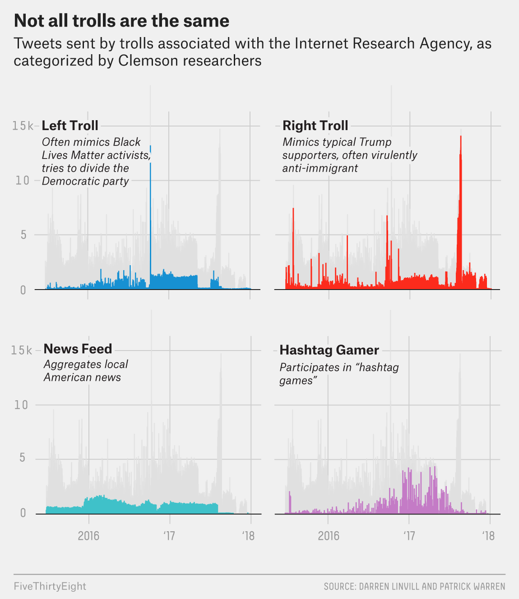

Why We’re Sharing 3 Million Russian Troll Tweets \| FiveThirtyEight

[Skip to main content](#content)

[FiveThirtyEight

FiveThirtyEight](/)
-------------------------------------

Search

Search

[ABC News](https://abcnews.go.com/ "ABC News")
Menu

 Why We’re Sharing 3 Million Russian Troll Tweets 
[Share on Facebook](https://fivethirtyeight.com/features/why-were-sharing-3-million-russian-troll-tweets/?share=facebook)
[Share on Twitter](https://fivethirtyeight.com/features/why-were-sharing-3-million-russian-troll-tweets/?share=twitter)

* [Politics](https://fivethirtyeight.com/politics/)
* [Sports](https://fivethirtyeight.com/sports/)
* [Science](https://fivethirtyeight.com/science/)
* [Podcasts](https://fivethirtyeight.com/podcasts/)
* [Video](https://fivethirtyeight.com/videos/)
* [Interactives](https://projects.fivethirtyeight.com/)
* [ABC News](https://abcnews.go.com/)

[This is an archived site and is no longer being updated. New 538 articles can be found at www.abcnews.com/538\.](http://abcnews.com/538)

Jul. 31, 2018,
 at
 8:26 AM

Why We’re Sharing 3 Million Russian Troll Tweets
================================================

By [Oliver Roeder](https://fivethirtyeight.com/contributors/oliver-roeder/)

Filed under [Russia Investigation](https://fivethirtyeight.com/tag/russia-investigation/)

Get the data on [GitHub](https://github.com/fivethirtyeight/russian-troll-tweets/)
GitHub data at [russian\-troll\-tweets](https://github.com/fivethirtyeight/russian-troll-tweets/)

 

When historians try to appraise Russia’s interference in the 2016 election, which historical artifacts will they use? Then\-candidate Donald Trump’s speech imploring Russia to find Hillary Clinton’s emails, perhaps. The soccer ball Vladimir Putin gave President Trump at their summit in Helsinki probably merits inclusion. And then there are the tweets — millions of them.

Earlier this year, as part of special counsel Robert Mueller’s investigation, the Justice Department [charged](https://www.justice.gov/file/1035477/download) 13 Russian nationals with interfering in American electoral and political processes. The defendants worked for a well\-funded “troll factory” called the Internet Research Agency, which had 400 employees, according to one Russian news report. From a [bland office building](https://www.nytimes.com/2015/06/07/magazine/the-agency.html) in St. Petersburg, the agency ran a sophisticated and coordinated campaign to sow disinformation and discord into American politics via social media. This often involved Trump’s favorite medium: Twitter.

Millions of the trolls’ tweets have since been removed from the service, and while other outlets, most prominently [NBC News](https://www.nbcnews.com/tech/social-media/now-available-more-200-000-deleted-russian-troll-tweets-n844731), have published samplings of them**,** it has been difficult to get a complete sense of the trolls’ strategy and the scale of their efforts. Until now.

FiveThirtyEight has obtained nearly 3 million tweets from accounts associated with the Internet Research Agency. To our knowledge, it’s the fullest empirical record to date of Russian trolls’ actions on social media, showing a relentless and systematic onslaught. In concert with the researchers who first pulled the tweets, FiveThirtyEight is [uploading them to GitHub](https://github.com/fivethirtyeight/russian-troll-tweets/) so that others can explore the data for themselves.

“It’s not about electing our next president. It’s about giving up everything we stand for or fighting back! \#WakeUpAmerica \#PodestaEmails6” — @THEFOUNDINGSON, Oct. 13, 2016 (24,382 followers)
The data set is the work of two professors at Clemson University: Darren Linvill and Patrick Warren. Using advanced social media tracking software, they pulled the tweets from thousands of accounts that Twitter has acknowledged as being associated with the IRA. The professors shared their data with FiveThirtyEight in the hope that other researchers, and the broader public, will explore it and share what they find. “So far it’s only had two brains looking at it,” Linvill said of their trove of tweets. “More brains might find God\-knows\-what.”

The data set [published here](https://github.com/fivethirtyeight/russian-troll-tweets/) includes 2,973,371 tweets from 2,848 Twitter handles. It includes every tweet’s author, text and date; the author’s follower count and the number of accounts the author followed; and an indication of whether the tweet was a retweet. The entire corpus of tweets published here dates from February 2012 to May 2018, with the vast majority from 2015 to 2017\.

Even a simple timeline of these tweets can begin to tell a story of how the trolls operated. For instance, there was a flurry of trolling activity on Oct. 6, 2016\. As the Washington Post [first pointed out](https://www.washingtonpost.com/technology/2018/07/20/russian-operatives-blasted-tweets-ahead-huge-news-day-during-presidential-campaign-did-they-know-what-was-coming/?utm_term=.2cd8624a4814) using the Clemson researchers’ findings, that may have been related to what happened on Oct. 7, 2016, when WikiLeaks released embarrassing emails from the Clinton campaign. There was another big spike in the summer of 2017, when the Internet Research Agency appeared to have shifted its focus to a specific type of troll — one the researchers call the “Right Troll” — that mimicked stereotypical Trump supporters.

According to a thorough account [on Wired](https://www.wired.com/story/how-americans-wound-up-on-twitters-list-of-russian-bots/) of the identification of the Russian trolls, as of June 2018, Twitter had identified 3,841 handles connected to the IRA. That [list](https://democrats-intelligence.house.gov/uploadedfiles/ira_handles_june_2018.pdf), along with the November 2017 [list](https://democrats-intelligence.house.gov/uploadedfiles/exhibit_b.pdf) that preceded it, forms the basis for the Clemson study, and the database published here includes every tweet from those handles from June 19, 2015, to Dec. 31, 2017\. (It also includes some tweets outside this date range but not exhaustively across handles. A number of the listed handles did not tweet during the sample period.)

When Twitter suspended these malicious accounts, it also deleted their tweets from public view.

“\#Clinton Campaign said they pitched a story to \#TheDailyBeast to attack \#BernieSanders. Why are we not surprised?” — @BLACKMATTERSUS, Oct. 13, 2016 (14,433 followers)
Reassembling this corpus of tweets is an exercise in a certain kind of national security. “Wiping the content doesn’t wipe out the damage caused, and it prevents us from learning about how to be better prepared for such attacks in the future,” said Alina Polyakova, a foreign policy fellow at the Brookings Institution.

But data archives can help rebuild this important piece of recent American history.

The Clemson researchers were able to gather this data thanks to Clemson’s [Social Media Listening Center](https://www.clemson.edu/cbshs/centers-institutes/smlc/), an interdisciplinary lab that captures “more than 650 million sources of social media conversations,” including Twitter, according to the center’s website. It is run on powerful Social Studio analytics software — produced by the firm Salesforce and typically used by public relations and marketing companies to check up on their brands. The program drinks from Twitter’s so\-called [firehose](http://www.public.asu.edu/~fmorstat/paperpdfs/icwsm2013.pdf) of data, archiving the tweets soon after they’re posted.

That resulting data set is at the heart of a [working paper](http://pwarren.people.clemson.edu/Linvill_Warren_TrollFactory.pdf) by Linvill and Warren, currently under review at an academic journal, titled “Troll Factories: The Internet Research Agency and State\-Sponsored Agenda Building.”

In the paper, Linvill and Warren divide the IRA’s trolling into five distinct categories, or roles: Right Troll, Left Troll, News Feed, Hashtag Gamer and Fearmonger. (These category codes are included in the data.)

Right Troll and Left Troll are the meat of the agency’s trolling campaign. Right Trolls behave like “bread\-and\-butter MAGA Americans, only all they do is talk about politics all day long,” Linvill said. Left Trolls often adopt the personae of Black Lives Matter activists, typically expressing support for Bernie Sanders and derision for Hillary Clinton, along with “clearly trying to divide the Democratic Party and lower voter turnout.” News Feeds are a bit of a mystery: They present themselves as local news aggregators, with names such as @OnlineMemphis and @TodayPittsburgh, and the news they link to is typically legitimate. Hashtag Gamers specialize in playing [hashtag games](http://ideas.time.com/2011/11/11/the-hashtag-game-waste-of-time-or-art-form/) (e.g., \#LessInterestingBooks might give rise to the tweet “Waldo’s Right Here”); many of their tweets are harmless wordplay in the spirit of the games, but some are socially divisive, in the style of Right Trolls or Left Trolls. And Fearmongers, relatively rare in the data set, spread news about a fake crisis, such as salmonella\-contaminated turkeys around Thanksgiving, or the toxic chemical fumes described at the beginning of the New York Times Magazine [article](https://www.nytimes.com/2015/06/07/magazine/the-agency.html) about the Internet Research Agency.

“In this data we can see, from hour to hour, how they’re using their human capital to move from one type of account to another type of account,” Linvill said. “We can really look at the structure of what the agency was doing.”

##### A trolling taxonomy

Tweets sent by Russian trolls associated with the Internet Research Agency, as categorized by Clemson researchers

| Category | Number of tweets | |
| --- | --- | --- |
| Non\-English | 837,725 | – |
| Right Troll | 719,087 | – |
| News Feed | 599,294 | – |
| Left Troll | 427,811 | – |
| Hashtag Gamer | 241,827 | – |
| Commercial | 122,582 | – |
| Unknown | 13,905 | – |
| Fearmonger | 11,140 | – |

Source: Darren Linvill and Patrick Warren

“Russia’s attempts to distract, divide, and demoralize has been called a form of political war,” the authors conclude in their paper. “This analysis has given insight into the methods the IRA used to engage in this war.”

This war may or may not have had an effect on the 2016 election, but it certainly wreaked havoc. The man who would be named national security adviser followed and pushed the message of Russian troll accounts, [according to the Daily Beast](https://www.thedailybeast.com/michael-flynn-followed-russian-troll-accounts-pushed-their-messages-in-days-before-election), and Trump’s eldest son, campaign manager and digital director each retweeted a Russian troll in the month before the election. Twitter itself [informed](https://blog.twitter.com/official/en_us/topics/company/2018/2016-election-update.html) 1\.4 million people that they’d interacted with Russian trolls.

But the researchers emphasized that the Russian disinformation and discord campaign on Twitter extends well beyond even that.

“There were more tweets in the year *after* the election than there were in the year before the election,” Warren said. “I want to shout this from the rooftops. This is not just an election thing. It’s a continuing intervention in the political conversation in America.”

“They are trying to divide our country,” Linvill added.

*If you use [the data](https://github.com/fivethirtyeight/russian-troll-tweets/) and find anything interesting, please let us know. Send your projects to oliver.roeder@fivethirtyeight.com or* [*@ollie*](https://twitter.com/ollie)*.*

*The Clemson researchers wish to acknowledge the assistance of the Clemson University Social Media Listening Center and Brandon Boatwright of the University of Tennessee, Knoxville.*

Oliver Roeder was a senior writer for FiveThirtyEight. He holds a Ph.D. in economics from the University of Texas at Austin, where he studied game theory and political competition.  [@ollie](https://twitter.com/ollie)

### Comments

Filed under

[2016 Election (1138 posts)](https://fivethirtyeight.com/tag/2016-election/)
[Russia Investigation (95\)](https://fivethirtyeight.com/tag/russia-investigation/)
[Trolls (3\)](https://fivethirtyeight.com/tag/trolls/)

Interactives
------------

Latest Videos
-------------

* ### [Why Biden Is Losing Support Among Voters Of Color](https://fivethirtyeight.com/videos/why-biden-is-losing-support-among-voters-of-color/?cid=rrfeaturedvideo)

* ### [Should We Trust Polls Campaigns Leak To The Press?](https://fivethirtyeight.com/videos/should-we-trust-polls-campaigns-leak-to-the-press/?cid=rrfeaturedvideo)

* ### [How Well Can You Tell The 2024 GOP Candidates Apart?](https://fivethirtyeight.com/videos/how-well-can-you-tell-the-2024-gop-candidates-apart/?cid=rrfeaturedvideo)

* ### [What The GOP Primary Looks Like In The Early States](https://fivethirtyeight.com/videos/what-the-gop-primary-looks-like-in-the-early-states/?cid=rrfeaturedvideo)

 Get more FiveThirtyEight 

* [Store](https://cottonbureau.com/stores/fivethirtyeight#/shop)
* [Twitter](https://twitter.com/fivethirtyeight)
* [Facebook](https://www.facebook.com/fivethirtyeight)
* [Data](https://data.fivethirtyeight.com/)
* [RSS](https://fivethirtyeight.com/features/fear-not-readers-we-have-rss-feeds/)

* 
* [Follow @FiveThirtyEight](https://twitter.com/FiveThirtyEight)

* [About Us](https://fivethirtyeight.com/about-us/)
* [Jobs](https://fivethirtyeight.com/jobs/)
* [Masthead](https://fivethirtyeight.com/masthead/)
* [Pitch FiveThirtyEight](https://fivethirtyeight.com/how-to-pitch-fivethirtyeight/)
* [Advertise With Us](https://disneyadsales.com/our-brands/abc-news/)
* [About Nielsen Measurement](http://priv-policy.imrworldwide.com/priv/browser/us/en/optout.html)

 Powered by [WordPress VIP](https://wpvip.com/?utm_source=vip_powered_wpcom&utm_medium=web&utm_campaign=VIP%20Footer%20Credit&utm_term=fivethirtyeight.com) 

* [Terms of Use](https://disneytermsofuse.com/)
* [Privacy Policy](https://disneyprivacycenter.com/)
* [Do Not Sell or Share My Personal Information](https://privacy.thewaltdisneycompany.com/en/dnssmpi/)
* [Your US State Privacy Rights](https://privacy.thewaltdisneycompany.com/en/current-privacy-policy/your-us-state-privacy-rights/)
* [Children's Online Privacy Policy](https://disneyprivacycenter.com/kids-privacy-policy/english/)
* [Interest\-Based Ads](https://preferences-mgr.truste.com/?type=abcnews&affiliateId=11&cid=clicksource_4380645_footer_interestbasedads)

 © 2024 ABC News Internet Ventures. All rights reserved.
 

Close Additional Information
[Terms of Use](https://disneytermsofuse.com/) and [Privacy Policy](https://disneyprivacycenter.com/) and Safety Information/[Your California Privacy Rights](https://disneyprivacycenter.com/notice-to-california-residents/)/[Children's Online Privacy Policy](https://disneyprivacycenter.com/kids-privacy-policy/english/) are applicable to you. © 2024 ABC News Internet Ventures. All rights reserved. [Interest\-Based Ads](https://preferences-mgr.truste.com/?type=abcnews&affiliateId=11&cid=clicksource_4380645_footer_interestbasedads). [Cookie Policy](https://disneyprivacycenter.com/cookies-policy-translations/cookies-policy/).
 

